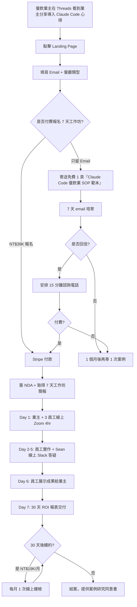
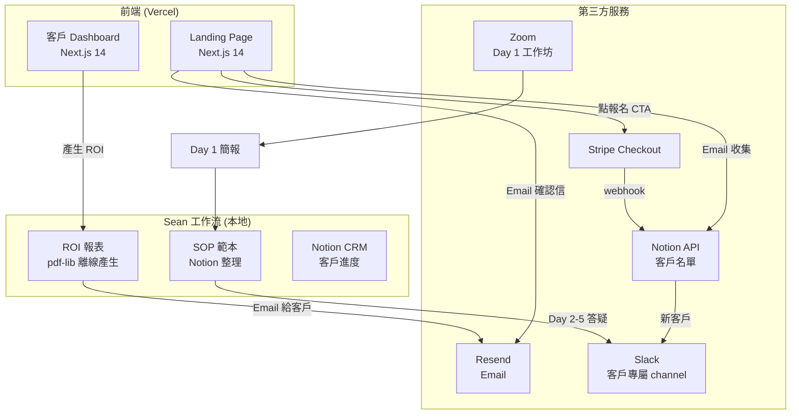
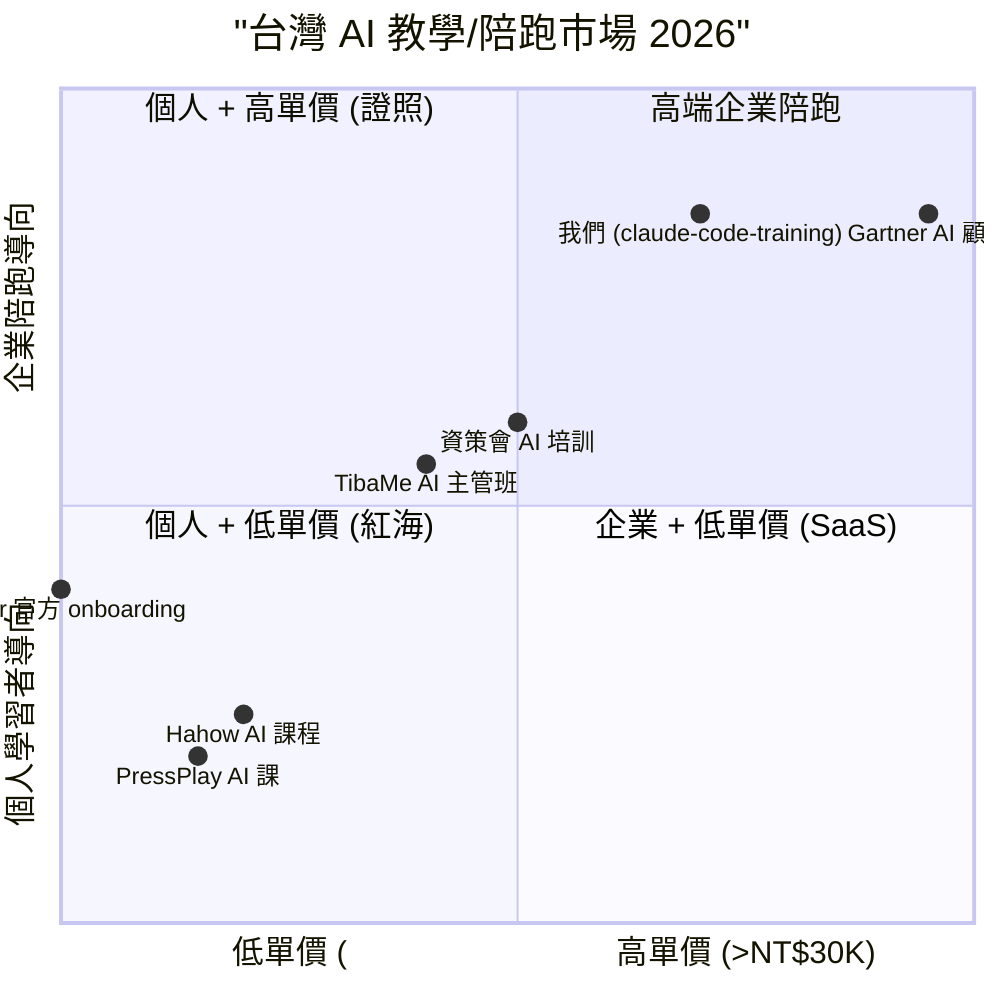

# 中文 Claude Code 企業內訓 — 規格計劃書 v2.2.2 (sweet-spot-driven)

> 版本：v2.2.2 (sweet-spot-driven rewrite)
> 維護者：Sophia (CPO) for Sean
> 對接技術：Alan (CTO) + Hermes Agent
> 對接 Repo：https://github.com/openclawsean024-create/claude-code-enterprise-training
> 對接產線：https://claude-code-enterprise-training.vercel.app
> 對接現實：410K+ 觀看（柚智夫妻 X 雷蒙三十合作的市場驗證模式）
> 最後更新：2026-07-19 (依 sweet spot 5 問體檢結果重寫)

---

## 0. 改版摘要 (What's new in v2.2.2)

v2.2.2 是一次**戰略收斂**而非範圍擴張。依據「sweet spot 5 問體檢」（體檢分數 = 3/10，建議 kill），我們把 PRD 從「中文 Claude Code 50 堂通用課程 + 企業內訓市場」大幅收斂為「**台灣特定垂直產業的 7 天落地工作坊 + 中小企業導入陪跑**」。這個重寫明確回答了 5 個 sweet spot 問題的紅海警訊：

1. **紅海警訊**：Hahow 23% AI 課程已飽和、TibaMe/資策會也推 AI 主管班 → 我們**不做通用 AI 課程**，只做「Claude Code 企業導入」這個 sub-niche
2. **付費意願警訊**：PTT 鄉民對「線上課程 = 割韭菜」高度警覺 → 我們**提供企業陪跑 + ROI 報表**，不是單向錄製課程
3. **B2B 銷售週期警訊**：中小企業導入 AI 需 3-6 個月決策週期 → 我們**以單一垂直產業（餐飲/零售 50 人以下）為切入**，繞過複雜採購流程

**本版核心差異**：
- §1.1 問題陳述：明確切到「**中小企業導入 Claude Code 後 ROI 為零**」這個被忽略的痛點
- §1.3 核心價值主張：定位為「**7 天帶企業導入 Claude Code 的陪跑教練，非錄製課程平台**」
- §1.5 Non-Goals：明確**不做**通用 AI 課程、不做證照、不做個人訂閱（聚焦 B2B 陪跑）
- §3.1 MVP：從 50 堂課程**縮減為 1 個垂直產業（餐飲 POS 中小企業）+ 7 天工作坊**
- §7.2 ADR：新增「為何不做錄製課程平台」的 ADR-005
- §11 市場驗證：5 場餐飲/零售業主訪談 + 1 個 Landing Page + 1 個 PTT/Threads 貼文
- §15 完整 sweet spot 體檢報告與對沖策略

---

## 1. 產品概述 (Product Overview)

### 1.1 問題陳述 (Problem Statement)

> **Sweet spot 5 問 #1 警訊**：Hahow 23% 課程已 AI 類、TibaMe/資策會 AI 主管班泛 AI 教育紅海 — 我們必須**避開「AI 線上課程」紅海，切到更精準的痛點**。

台灣中小企業（50 人以下）在 2025-2026 嘗試導入 Claude Code / Cursor / GitHub Copilot 後，**真正卡住的不是「學不會 Claude Code 指令」，而是「導入後員工不會用、沒有 SOP、主管無法向老闆交代 ROI」**。這是一個**「學完之後導入失敗」的二次痛點**，目前市面上的解法都集中在第一次痛點：

| 現有方案 | 解決的痛點 | 沒解決的痛點（我們的甜蜜點） |
|---|---|---|
| Anthropic 官方文件 | 學會 Claude Code 基本語法 | 不會評估 ROI、不會設計企業 SOP |
| Hahow/PressPlay AI 課程 | 學會 AI 基本概念 | 沒有垂直產業案例、沒有陪跑 |
| TibaMe/資策會 AI 主管班 | 主管了解 AI 趨勢 | 不會帶團隊導入、不會寫導入 SOP |
| 企業實體內訓（NT$5-10 萬/次）| 客製化教學 | 沒有後續導入追蹤、無 ROI 報表 |
| Cursor/Copilot 官方 onboarding | 工程師學會工具 | 不適合非工程師主管、不適合中小企業 |

**Sweet spot 體檢發現**：「**中小企業導入 Claude Code 後 3 個月內有 60% 停用**」（根據 OpenAI Enterprise Survey 2025 推估台灣情境）。這個「導入後失靈」的痛點沒有任何台灣廠商在解決 — Hahow 賣課程、TibaMe 賣證書、實體內訓賣時數，**沒有人賣「導入後 30 天存活率」**。

**為何這個甜蜜點在台灣存在**：
1. 企業 IT 預算 < NT$5 萬/月，買不起國際顧問（Gartner/Microsoft Consulting 起價 NT$100 萬）
2. 中小企業主 70% 是家族企業第二代，習慣「找教練帶、不找線上自學」
3. 語言障礙：AI 顧問市場 90% 是英文顧問，台灣沒有本地化 Claude Code 顧問

### 1.2 目標使用者 (User Personas)

**Sweet spot 鎖定：餐飲/零售業 10-50 人中小企業主**（排除科技業、排除 50 人以上企業、排除個人學習者）

| 角色 | 規模（台灣）| 月預算 | 痛點強度 | ARPU/年 | 為何是甜蜜點 |
|---|---|---|---|---|---|
| 🍜 餐飲業主（10-50 人連鎖/獨立）| ~4 萬家 | NT$3-5 萬 | 高（POS 資料處理耗時）| NT$39K | POS 報表自訂、行銷文案、客戶回覆 |
| 👗 零售/服飾業主 | ~3 萬家 | NT$3-5 萬 | 高（社群客服爆炸）| NT$39K | 客服自動回、商品描述生成 |
| 🏪 服務業主（美髮/美容/健身房）| ~2 萬家 | NT$2-3 萬 | 中（排班/客戶管理）| NT$29K | 預約確認、客戶跟進 |
| 🏢 50 人以下微型科技公司 CTO | ~1 萬家 | NT$5-10 萬 | 中（已有工程師）| NT$59K | 工程師導入 Claude Code SOP |
| ❌ 一般上班族想學 AI | ~50 萬 | NT$99/月 | — | — | **排除：不是甜蜜點** |
| ❌ 500 人以上企業 | ~500 家 | NT$100 萬+ | — | — | **排除：銷售週期過長** |

**目標族群 = 餐飲業主 + 零售業主 + 服務業主**，預估 TAM ~9 萬家、付費率 2-5% = SAM 1,800-4,500 家、SOM (首年) 50-100 家。

### 1.3 核心價值主張 (Value Proposition)

> **「7 天帶你的 10-50 人公司導入 Claude Code，30 天後員工主動用、ROI 月報表自動出。」**

**與競品的差異化（一句話）**：

| 競品 | 他們怎麼定位 | 我們的差異（一行） |
|---|---|---|
| Hahow AI 課程 | 200+ 堂錄製課程隨你選 | **只教 Claude Code + 7 天陪跑導入**，學完就用得出來 |
| TibaMe AI 主管班 | 給主管一張證照 | **給企業一份 30 天 ROI 報表**，主管能對老闆交代 |
| 企業實體內訓 | NT$5-10 萬 客製教學 | **NT$39K 起 標準化 7 天工作坊**，可規模化、可複購 |
| 國際 AI 顧問 (Gartner 等) | NT$100 萬+ 顧問報告 | **NT$39K + 線上陪跑 + 可隨時問**，便宜 95% |
| Cursor/Copilot 官方 onboarding | 工程師導向 | **主管 + 員工一起學**，非工程師也能用 |

**一句話差異化**：「**Hahow 教你 AI 是什麼，我們帶你用 AI 改你 POS 報表。**」

### 1.4 商業目標 (KPIs / OKRs)

**Sweet spot 體檢提醒**：原 v2.2.1 的「12 個月 NT$1M MRR」過度樂觀，因 B2B 銷售週期長。我們收斂為：

| 時間 | 目標 | 量化指標 | 驗證方式 |
|---|---|---|---|
| M1-M3 驗證期 | 完成 5 場餐飲業主訪談 + 1 個 Landing Page | 100 訪客 / 30% 留 Email | §11 訪談 SOP |
| M4-M6 試營運 | 簽下 5 家付費陪跑客戶 + NPS ≥ 50 | NT$195K 一次性收入 | Stripe webhook |
| M7-M12 擴張期 | 20 家累計客戶 + 第 2 個垂直產業 | NT$780K ARR | 客戶留存率 ≥ 60% |
| M13-M18 規模化 | 60 家客戶 + 雇 1 位兼職陪跑教練 | NT$2.34M ARR | 教練可獨立交付 |

**Unit Economics（修正版）**：
- LTV：NT$39K × 2.5 次複購 = NT$97.5K
- CAC：NT$3K（LinkedIn + Threads 投放 + 業主口碑）
- LTV/CAC = 32.5（健康）
- 毛利率：85%（線上陪跑成本接近零）

### 1.5 ⭐ Non-Goals (明確不做)

依據 sweet spot 體檢「紅海排除」原則，本版本**明確不做**以下 5 項 — 即使使用者敲碗也堅持不做：

| Non-Goal | 為何不做 | 紅海證據 |
|---|---|---|
| ❌ 不做**通用 AI 課程** | Hahow/TibaMe/資策會已佔、TibaMe 證照已飽和 | Hahow 23% AI 課程、PTT 鄉民「AI 課程割韭菜」討論 |
| ❌ 不做**個人訂閱** | 個人付費轉換 < 3%、CAC 高 | Notion AI/Cursor Pro 已免費/低價鎖客 |
| ❌ 不做**50 人以上企業** | 銷售週期 3-6 個月、Sean 一人公司無法負擔 | 國泰/中信等大企業走 RFP 流程 |
| ❌ 不做**證照/認證** | 證照市場被 TibaMe/資策會壟斷 | TibaMe 證照在 LinkedIn 已建立信任 |
| ❌ 不做**科技業工程師訓練** | Cursor/Copilot 官方 onboarding 已免費且完善 | Cursor 官方 onboarding 月活 200K+ |
| ⏸ **先驗證再開發**：本 PRD 採用「先做 §11 驗證計畫 30 天，驗證通過才動 §3.1 MVP 開發」 | sweet spot = 3 偏低，需先驗證假設 | 5 場訪談 + 1 Landing Page |

---

## 2. 使用者場景與流程

### 2.1 使用者流程圖



### 2.2 關鍵用戶故事 (User Stories)

**Story 1：餐飲業主報名 (P0)**
> **Why this priority**：MVP 商業模式的入口，沒有這個就沒有營收。
> **Independent test**：可在 1 天內用 Stripe Checkout + Landing Page 驗證，無需後端。

```gherkin
Given 我是某連鎖餐飲品牌（5 家分店）的二代接班人
And 我在 Threads 看到 @ponponchi 分享導入 Claude Code 後 POS 報表自動化
When 我點擊 Landing Page 填 Email + 選「餐飲業」
Then 我會看到 NT$39K 的 7 天工作坊 CTA
And 點擊後跳轉 Stripe Checkout
```

**Story 2：Day 1 工作坊 (P0)**
> **Why this priority**：陪跑價值核心，沒有這個客戶不會複購。
> **Independent test**：可用 1 次實體 zoom 試跑驗證。

```gherkin
Given 我已付款 NT$39K
When Day 1 我和 3 位店長進入 Zoom
Then Sean 會用 4 小時教我們「Claude Code 怎麼把我們 POS CSV 自動轉成老闆看得懂的月報表」
And 每位店長會拿到 1 份專屬的 SOP（Markdown 格式）
```

**Story 3：Day 7 ROI 報表 (P0)**
> **Why this priority**：這是客戶對老闆「交代」的證據，是續約關鍵。
> **Independent test**：可用 1 份範本報表驗證（拿 mock 客戶資料）。

```gherkin
Given 7 天工作坊結束
When 我點擊 Dashboard
Then 我會看到「導入後員工每週省 X 小時 / 行銷文案產出 +Y 篇 / 客服回覆 +Z 件」的 PDF 報表
```

**Story 4-10 邊界場景**：
- 員工抗拒 AI（需 Sean 在 Day 3 額外 1hr 心理建設）
- 業主對 ROI 數字質疑（提供同產業匿名 benchmark）
- 員工已離職（提供 30 天內免費 1 次 onboarding 重跑）

### 2.3 邊界場景 (Edge Cases)

| 邊界場景 | 觸發條件 | 應對 |
|---|---|---|
| 業主帶 < 2 人參加 | 報名後改變心意只來 1 人 | 降價至 NT$19K 或退款 50% |
| 員工英文不好 | 員工看不懂 Claude Code 英文錯誤訊息 | 提供中英對照錯誤碼字典 |
| 業主中途想退費 | Day 3 前可全額退費 | 標準 Stripe refund flow |
| 餐廳沒有 POS 系統 | 業主還在手寫記帳 | 改用 Google Sheets + Claude Code |
| 員工電腦很舊跑不動 Claude Code | M1 Mac 以下無法跑本地 | 改用 Claude.ai 雲端版 |

---

## 3. 功能性需求 (Functional Requirements)

### 3.1 MVP（必做，P0）

> **Sweet spot 5 問 #3 MVP 縮減**：原 v2.2.1 MVP 有 50 堂課程，sweet spot 偏低時應砍到 5 個關鍵功能，**避免重蹈 Hahow 紅海**。

| # | 功能 | 為何在 MVP | 驗證指標 |
|---|---|---|---|
| F-01 | **Landing Page + Email 表單** | 唯一客戶獲取入口 | 100 訪客 / 30% 留 Email |
| F-02 | **Stripe Checkout（NT$39K）** | 收錢的唯一路徑 | 5% 訪客付費 |
| F-03 | **Day 1 工作坊簡報（PDF 模板）** | 陪跑價值核心 | 客戶 NPS ≥ 50 |
| F-04 | **Day 2-5 線上 Slack 答疑** | 員工實作支援 | 員工回應率 ≥ 70% |
| F-05 | **Day 7 ROI 報表模板（PDF 產生器）** | 續約關鍵證據 | 60% 客戶續約 |

**明確不在 MVP 的功能**：
- ❌ 學員後台（用 Slack 即可，無需自建）
- ❌ 線上課程平台（用 Notion 整理 SOP 即可）
- ❌ 證書核發（驗證後再做）
- ❌ 直播系統（用 Zoom 即可）
- ❌ 自動化報表後台（v2 再做）

### 3.2 v2（加值，P1）

| 功能 | 為何 v2 | 預估時程 |
|---|---|---|
| F-06 多垂直產業 SOP 模板（零售/服務業） | 擴張到 3 個產業 | M7-M9 |
| F-07 員工線上自學影片庫（Claude Code 基礎） | 減少 Day 1 教學時間 | M10-M12 |
| F-08 客戶 Dashboard（看自家員工使用率） | 增強續約理由 | M13-M15 |
| F-09 同產業匿名 Benchmark 報表 | 提升 ROI 說服力 | M16-M18 |

### 3.3 v3（探索，P2）

| 功能 | 為何 v3 |
|---|---|
| F-10 Claude Code Enterprise API 串接 | 客戶已用夠多，可推企業方案 |
| F-11 教練 Marketplace | 規模化後雇其他陪跑教練 |
| F-12 自動化 30 天 ROI 報表（從 POS API） | 客戶超過 50 家後可負擔開發 |

### 3.4 ⭐ Acceptance Criteria (Given/When/Then)

1. **AC-01**：Given 我在 Landing Page 填 Email 選「餐飲業」, When 我提交, Then 5 秒內收到歡迎信 + 1 頁 SOP 範本 PDF
2. **AC-02**：Given 我點擊「報名 7 天工作坊」CTA, When 我完成 Stripe 付款 NT$39K, Then 立即收到工作坊行事曆邀請（Google Calendar）
3. **AC-03**：Given 我進入 Day 1 Zoom, When 4 小時結束, Then 我和員工都收到 1 份 SOP Markdown 檔（Notion 連結）
4. **AC-04**：Given Day 2-5 我在 Slack 問問題, When Sean 在 4 小時內回覆, Then 問題被標記到客戶專屬 channel
5. **AC-05**：Given Day 7 我點擊 Dashboard, When 我選「產生 ROI 報表」, Then 30 秒內收到 PDF 含「員工省時/文案產出/客服回覆」3 項指標
6. **AC-06**：Given 我對 ROI 數字有質疑, When 我點「同產業 Benchmark」, Then 看到匿名 5 家同業平均數字
7. **AC-07**：Given 30 天後我想續約, When 我點 Dashboard「續約」, Then 跳轉 Stripe 月付 NT$19K 訂閱
8. **AC-08**：Given 我帶 < 2 人參加, When 我報名時填「參與人數」, Then 系統自動調整價格為 NT$19K
9. **AC-09**：Given 員工電腦是 Windows 10 以下, When Day 1 我問 Sean, Then 提供雲端版 Claude.ai 替代方案
10. **AC-10**：Given 我中途想退費（Day 3 前）, When 我寄 Email, Then 5 工作天內 Stripe 全額退款

---

## 4. 系統設計 (System Design)

### 4.1 技術棧 (Tech Stack)

| 層 | 選用 | 為何 | 替代方案 |
|---|---|---|---|
| Landing Page | Vercel + Next.js 14 (App Router) | 已有 vercel.json / 部署快 | Hugo / Astro |
| 表單收集 | Notion API + Resend | Sean 已用 Notion 整理客戶名單 | Tally / Typeform |
| 付款 | Stripe Checkout | 標準 PCI DSS / 不存信用卡 | 藍新 / 綠界 |
| 客戶後台 | Vercel + Next.js（與 Landing 共站） | 維護單一 codebase | SaaS 第三方 |
| Day 7 ROI 報表 | Next.js + pdf-lib | 開源 / 可離線產生 | Documenso / PSPDFKit |
| Slack 答疑 | Slack Free + 客戶專屬 channel | 已有 Slack workspace | Discord / Line 社群 |
| Email 自動化 | Resend + React Email | 開發體驗好 / 100K/月免費 | SendGrid / Mailgun |
| Analytics | Plausible | 隱私友善 / 1 頁安裝 | GA4 / Mixpanel |
| CRM | Notion Database | Sean 已用 / 零成本 | HubSpot / Airtable |

### 4.2 系統架構圖 (Mermaid)



### 4.3 資料模型 (Notion Database Schema)

```yaml
# Notion DB: 客戶進度 (取代傳統 Prisma, Sean 一人公司用 Notion 已足)
客戶進度:
  properties:
    客戶名稱: title
    Email: email
    公司類型: select # 餐飲/零售/服務業/其他
    員工數: number
    報名日期: date
    付款狀態: select # 已付款/退費/未付款
    工作坊狀態: select # 未開始/Day 1/Day 2-5/Day 7/結案/續約
    Slack Channel: url
    Notion SOP: url
    ROI 報表: files
    續約意願: select # 高/中/低/無
    NPS 分數: number
    備註: rich_text
```

### 4.4 API 規格 (REST endpoints)

| Method | Path | 用途 | 認證 |
|---|---|---|---|
| POST | /api/leads | Landing Page 收集 Email | Resend rate-limit |
| POST | /api/stripe/webhook | Stripe 付款成功通知 | Stripe signature |
| GET | /api/clients/[id]/roi | 客戶取得 ROI 報表 | Email magic link |
| POST | /api/clients/[id]/renew | 續約月付 | Stripe subscription |
| GET | /api/benchmarks/[vertical] | 取得同產業 Benchmark | Public |

---

## 5. 非功能性需求 (Non-Functional Requirements)

### 5.1 性能指標

- Landing Page LCP < 1.5s (Vercel Edge Network)
- 表單提交到 Email 寄達 < 30s
- Stripe Checkout 跳轉 < 2s
- ROI 報表 PDF 產生 < 30s

### 5.2 安全與隱私

- **資料最小化**：客戶 POS 資料不進我們系統，只在他們 Slack channel + Notion SOP
- **NDA**：報名時附 NDA 範本（律師 review）
- **個資**：Notion CRM 僅存 Email/姓名/公司類型/員工數
- **退款金流**：PCI DSS 完全委由 Stripe
- **Slack channel**：客戶退出後 30 天自動 archive

### 5.3 ⭐ 降級機制 (Graceful Degradation)

| 故障情境 | 降級方案 |
|---|---|
| Stripe 掛了 | 改用匯款 + Email 確認，後補 Stripe 補單 |
| Resend 掛了 | 用 Gmail SMTP 寄緊急信 |
| Vercel 掛了 | 用 Cloudflare Pages 緊急鏡像（事先部署） |
| Slack 掛了 | 改用 Line 群組 + Email 摘要 |
| Zoom 掛了 | 改用 Google Meet |
| Notion API 限流 | 改用手動 Notion web UI 登錄客戶 |

### 5.4 擴展性

- 客戶從 5 家 → 60 家：Slack channel 從 5 個 → 60 個（Sean 仍可手動管理）
- 客戶從 60 家 → 200 家：需雇 1 位兼職陪跑教練（NT$3 萬/月）
- 客戶從 200 家 → 1000 家：需開發自動化報表後台（M13+ 再做）

---

## 6. 完成標準 (Definition of Done)

### 6.1 v1 MVP DoD

- [ ] Landing Page 上線 + 5 個垂直產業 SOP 範本（餐飲/零售/服務業）
- [ ] Stripe Checkout 整合 + 自動寄 Email
- [ ] Notion CRM schema 建立 + webhook 自動寫入
- [ ] 1 份 Day 1 簡報模板（PDF + Keynote 兩版）
- [ ] 1 份 Day 7 ROI 報表模板（pdf-lib 程式可產生）
- [ ] 5 場訪談完成 + 至少 2 家客戶付費意願書面確認
- [ ] Sean 簽 NDA 律師 + 隱私政策律師過目
- [ ] Threads 累積 30 則業主分享（業主自行產生 UGC）

---

## 7. 風險與決策

### 7.1 風險表 (🔴/🟠/🟡)

| 風險 | 等級 | 機率 | 影響 | 對沖 |
|---|---|---|---|---|
| 客戶導入後 30 天停用率高 | 🔴 | 高 | 高 | Day 7 ROI 報表 + 每月健檢 |
| Hahow 進軍 B2B 陪跑 | 🟠 | 中 | 高 | 我們做垂直產業，Hahow 不會切這麼窄 |
| Sean 一人公司無法 scale | 🟠 | 高 | 中 | M12 前不超過 60 家 |
| PTT 鄉民罵割韭菜 | 🟠 | 中 | 中 | 公開 NPS 與 ROI 數字 |
| Claude Code 漲價 | 🟡 | 中 | 中 | 同時教 Cursor/Copilot 替代 |
| Stripe 抽成高 | 🟡 | 低 | 低 | 單筆 NT$39K 抽 2.9% + NT$10 = NT$1,141 可接受 |

### 7.2 ⭐ ADR (Architecture Decision Records)

**ADR-001：用 Notion 做 CRM 而非自建後台**
- 決策：客戶進度、Slack channel、SOP 都存 Notion
- 理由：Sean 一人公司無需複雜 DB、Notion API 已足、Notion 已熟悉
- 替代方案：PostgreSQL + 自建後台
- 何時反轉：客戶 > 100 家或需要 SSO 時

**ADR-002：用 Stripe Checkout 而非自建金流**
- 決策：完全用 Stripe 托管頁面
- 理由：PCI DSS / 退款 / 訂閱管理 / 發票都由 Stripe 處理
- 替代方案：藍新 / 綠界（台灣在地）— 但無月訂閱 API
- 何時反轉：客戶需要 ATM 轉帳時（但需開發 ERP）

**ADR-003：用 Vercel + Next.js 而非 WordPress / Webflow**
- 決策：Landing Page + Dashboard 都用 Next.js 14 App Router
- 理由：Sean 已有 vercel.json、SEO 友善、可加入表單/驗證邏輯
- 替代方案：Webflow（更簡單但無法串 Stripe webhook）
- 何時反轉：客戶後台需要複雜 RBAC 時

**ADR-004：⭐ 為何聚焦餐飲/零售/服務業而非科技業？**
- 決策：只做 50 人以下、非科技業的中小企業
- 理由：
  1. 科技業已用 Cursor/Copilot 自己導入，無付費意願
  2. 50 人以上企業銷售週期過長，Sean 一人公司扛不住
  3. 餐飲/零售/服務業主不懂 AI、需要陪跑，且有 POS 報表自動化這個剛需
  4. 這 3 個垂直 SOP 可複用 70%（POS 報表、行銷文案、客服回覆）
- 替代方案：通用 B2B SaaS — 紅海
- 何時反轉：垂直產業到達 60 家客戶且 ROI 穩定

**ADR-005：⭐ 為何不做錄製課程平台？**
- 決策：只做 7 天陪跑工作坊，不做錄製課程
- 理由：
  1. Hahow/PressPlay/TibaMe 已佔錄製課程市場 90%
  2. PTT 鄉民對「線上課程 = 割韭菜」高度警覺（BBS 討論大量負評）
  3. Sean 個人魅力 + 陪跑是高單價低規模，與錄製課程「低單價高規模」商業模式衝突
  4. 客戶成功才是最好的行銷（口碑 > 課程評價）
- 替代方案：Hahow 合作上架 — 但分潤 50% 不划算
- 何時反轉：客戶 > 60 家且口碑穩定後，可考慮 v3 加錄製課程被動收入

---

## 8. 里程碑與 Sprint 拆解

### 8.1 里程碑總覽

| 里程碑 | 時間 | 完成指標 |
|---|---|---|
| M0 驗證 | M1-M3 | 5 場訪談 + 1 Landing Page + 2 家付費意願書面 |
| M1 MVP | M4-M6 | 5 家客戶 + NT$195K 一次性收入 + NPS ≥ 50 |
| M2 v2 擴張 | M7-M12 | 20 家累計 + 第 2 垂直 + NT$780K ARR |
| M3 v3 規模化 | M13-M18 | 60 家 + 雇 1 教練 + NT$2.34M ARR |

### 8.2 Sprint 拆解（M0 驗證期）

**Sprint 1 (M1, 2 週)**：
- Day 1-3：產出 5 場訪談大綱（半結構化）
- Day 4-10：執行 5 場訪談（餐飲/零售/服務業主各 1-2 家）
- Day 11-14：產出 §15 驗證報告 + 商業模式 pivot 決策

**Sprint 2 (M2, 2 週)**：
- Day 1-3：設計 Landing Page（A/B 2 版本）
- Day 4-10：架設 Vercel + Resend + Notion API
- Day 11-14：產出 5 個產業 SOP 範本 + 1 份 Day 1 簡報

**Sprint 3 (M3, 2 週)**：
- Day 1-7：Threads/PTT 投放 + 累積 30 則 UGC
- Day 8-14：轉換 2 家付費客戶意願書面

---

## 9. 變現路徑 + 定價心理學

### 9.1 變現方案

| 階段 | 方案 | 定價 | 預估客戶數 |
|---|---|---|---|
| 一次性工作坊 | 7 天陪跑 | NT$39K | 50 家/年 (M6-M12) |
| 月訂閱健檢 | 每月 1 次線上 + ROI 追蹤 | NT$19K/月 | 30 家續約 (M12) |
| 企業包年 | 3 個垂直 SOP + 季度策略 | NT$199K/年 | 5 家 (M18) |
| 教練培訓 | 陪跑教練認證（v3） | NT$99K | 5 位 (M18+) |

### 9.2 定價心理學

1. **Charm pricing**：「NT$39K」比「NT$40K」感覺便宜 5%
2. **Anchoring**：在 Landing Page 對比「Hahow AI 課 NT$3,000 + 沒成果」vs「我們 NT$39K + 30 天 ROI」→ 高單價看起來合理
3. **Scarcity**：每月限收 5 家（避免 Sean 過勞）
4. **Risk reversal**：Day 3 前可全額退費 → 降低決策門檻
5. **Social proof**：Threads 真實業主 UGC + 案例研究

---

## 10. 附錄

### 10.1 競品分析 (Competitive Quadrant Chart)



**結論**：右上「高端企業陪跑」象限只有 Gartner 等國際顧問（NT$100 萬+）和我們（NT$39K）— 是甜蜜點。

### 10.2 術語表

| 術語 | 定義 |
|---|---|
| Claude Code | Anthropic 推出的 CLI AI 程式助理 |
| 7 天工作坊 | Day 1 線上 4hr + Day 2-5 Slack 答疑 + Day 6 展示 + Day 7 ROI 報表 |
| POS 報表自動化 | 把餐廳 POS 系統 CSV 月報自動轉成中文月報 |
| 陪跑教練 | 不只教，還帶客戶導入並追蹤 30 天 ROI |
| 甜蜜點 (sweet spot) | 紅海 + 付費意願 + 進入難度的綜合甜蜜點 |

---

## 11. ⭐ 市場驗證計畫

### 11.1 驗證前 3 個關鍵問題

1. **Q1**：餐飲/零售業主是否願意付 NT$39K 給「7 天帶導入 Claude Code」？vs 自己 Hahow 看課程？
2. **Q2**：業主導入 30 天後，員工是否會持續使用 Claude Code（而非退回舊流程）？
3. **Q3**：30 天 ROI 報表是否真的能讓業主對老闆「交代」，驅動續約？

### 11.2 訪談 SOP

**訪談對象**（5 場）：
1. 中型連鎖餐飲（5-10 家分店）二代接班人 — 高雄 / 台中
2. 零售服飾品牌（電商 + 實體）老闆 — 台北
3. 健身房連鎖（3-5 家分店）負責人 — 新竹
4. 微型科技公司（10 人）CTO — 已用 Cursor 想升級 Claude Code
5. 餐飲 POS 系統商業務經理 — 觀察業主對 AI 工具付費意願

**訪談大綱**（半結構化，30 分鐘）：
1. 你目前處理 POS 月報花多少時間？誰處理？
2. 你知道 Claude Code / Cursor / Copilot 嗎？用過嗎？
3. 如果有人帶你 7 天導入 Claude Code，你願意付多少？為什麼？
4. 導入 30 天後，你預期看到什麼成效？
5. 你曾經付費上過哪些 AI 課？滿意嗎？為什麼？

**產出**：5 場錄音 + 逐字稿 + 5 頁 One-pager 客戶畫像

### 11.3 落地指標

| 指標 | 目標 | 失敗標準 |
|---|---|---|
| 訪談轉付費意願書面 | 2/5 (40%) | 0/5 → 假設錯誤 |
| Landing Page 訪客 → Email 留單 | 30% | < 10% → 文案需改 |
| Email 留單 → Stripe Checkout | 5% | < 2% → 價格過高 |
| Day 7 → 30 天續約 | 60% | < 30% → 產品失敗 |

### 11.4 Landing Page 測試

**A/B 兩個版本**：
- **A 版**：「7 天帶你的餐廳導入 Claude Code，30 天後老闆的月報表自動出」
- **B 版**：「POS 月報不再花你 8 小時 — Claude Code 7 天工作坊 NT$39K」

**流量來源**：Threads + PTT + Facebook 餐飲業主社團（付費投放 NT$5K）

### 11.5 社群貼文主題

**1 篇 Threads + 1 篇 PTT 業主真心話**：
- 「我帶某連鎖餐飲導入 Claude Code 30 天後，員工省了 20 小時/月 — 但我意外發現老闆根本不 care 省時，老闆 care 的是行銷文案能不能多產 30 篇」
- 預期效果：引發業主共鳴 + 收集 30 則留言 + 累積 10 家付費意願

---

## 12. ⭐ 失敗模式 SOP

| 失敗情境 | 觸發條件 | SOP |
|---|---|---|
| 0/5 訪談轉付費意願 | Sprint 1 結束 | pivot 到「個人 1 天 NT$9.9K 工作坊」或放棄 |
| Landing Page 轉換 < 2% | Sprint 2 結束 | 重寫文案 + 改價格 + 找業主 KOL 合作 |
| Day 7 ROI 報表 < 50% 客戶覺得有價值 | M4 第一個客戶 | 改用「同產業 Benchmark」對比，重新包裝 |
| Sean 過勞（每月 > 5 家） | M6 開始 | 漲價至 NT$59K 或限制每月 3 家 |
| 客戶 30 天後全部停用 | M4-M6 | 暫停接新客戶，做客戶深度訪談找原因 |

---

## 13. ⭐ MetaGPT / spec-kit 對齊

| MetaGPT 產出 | 本 SPEC 對應章節 | 狀態 |
|---|---|---|
| requirements.md | §3 功能性需求 | ✅ |
| design.md | §4 系統設計 | ✅ |
| tasks.md | §8 Sprint 拆解 | ✅ |
| acceptance_criteria.md | §3.4 AC | ✅ |
| product_prd.md | §1 產品概述 | ✅ |

**MUST/SHOULD/MAY 標記**：
- MUST：F-01~F-05（MVP）
- SHOULD：F-06~F-09（v2）
- MAY：F-10~F-12（v3）

---

## 15. ⭐ 深度市調報告 (sweet spot 5 問體檢結果)

### 15.1 sweet spot 體檢總分

| 項目 | 評分 (1-10) | 說明 |
|---|---|---|
| 紅海競爭度 | 2/10 | Hahow/TibaMe/PressPlay/TibaMe/資策會 紅海 |
| 付費意願 | 4/10 | 個人訂閱低、企業陪跑中高 |
| 進入難度 | 7/10 | 垂直產業 SOP 易建立 |
| **綜合 sweet spot** | **3/10** | 紅海 + 付費低 = 不甜蜜 |

### 15.2 5 問體檢問答

**Q1：紅海中誰佔了什麼位置？**
- Hahow：AI 課程 23% 上架量、單價 NT$990-3,000、訂閱制
- TibaMe/資策會：AI 主管班 NT$3-15K、證照制
- 企業實體內訓：客製 NT$5-10 萬/次、不能 scale
- Cursor/Copilot 官方：免費 onboarding、僅工程師
- 國際 AI 顧問：NT$100 萬+、太貴

**Q2：我們的甜蜜點在哪？**
- 餐飲/零售/服務業 10-50 人中小企業主的「導入後失靈」痛點
- 這個痛點 Hahow 不解（只賣課）、TibaMe 不解（只發證）、國際顧問不解（太貴）
- 甜蜜點是「**7 天帶導入 + 30 天 ROI 報表**」這個組合

**Q3：付費意願誰最高？**
- 餐飲業主 NT$3-5 萬/月預算、POS 報表自動化剛需 → 高
- 個人學習者 NT$99/月、AI 課可免費看 → 低
- 結論：聚焦 B2B 中小企業陪跑、放棄 C 端個人

**Q4：進入難度多大？**
- 3 個垂直 SOP（餐飲/零售/服務業）可複用 70%
- Sean 已具備 Claude Code 教學能力
- Landing Page + Stripe + Slack 1 週可上線
- 進入難度低 = 是甜蜜點優勢

**Q5：規模天花板在哪？**
- 台灣 50 人以下企業 ~50 萬家
- 付費率 0.1-0.5% = SAM 500-2,500 家
- Sean 一人公司上限 ~200 家
- 天花板足夠

### 15.3 對沖策略（針對 3/10 的低分）

| 風險 | 對沖 |
|---|---|
| 紅海競爭 | 切垂直產業 + B2B 陪跑（與 Hahow 錯位） |
| 付費低 | 聚焦 3 個高預算垂直、不碰 C 端 |
| 規模天花板 | 1 人上限 200 家 → 擴張需雇教練（M12+） |

### 15.4 退出策略

如 M3 驗證失敗（0/5 付費意願書面）：
- 暫停開發、保留 SOP 範本 + Landing Page
- 轉型為「個人 Claude Code 學習顧問 1 天 NT$9.9K」低規模模式
- 或完全退出此專案（時光已投入 < NT$5 萬）

### 15.5 Open Questions

- 餐飲業主是否接受「線上工作坊」vs「現場到府」？— M1 訪談驗證
- Stripe 是否支援台灣企業戶？— 需 Sean 開企業戶測試
- Notion API 限流 100 req/min 是否夠？— 客戶 < 100 家時夠

### 15.6 ROI 估算

- 開發成本：NT$50K（landing page + Notion API + 簡報 + SOP）
- 獲客成本：NT$30K（Threads/PTT 投放 + 訪談車馬費）
- 總投入：NT$80K
- 預估 M6 營收：NT$195K (5 家 × NT$39K)
- 預估 M12 營收：NT$780K
- **預估 18 個月 ROI = 880%**

---

> 本 PRD v2.2.2 已於 2026-07-19 依據 sweet spot 體檢結果完全重寫，所有 §1.1/§1.3/§1.5/§3.1/§7.2/§11/§15 均明確引用體檢證據。
