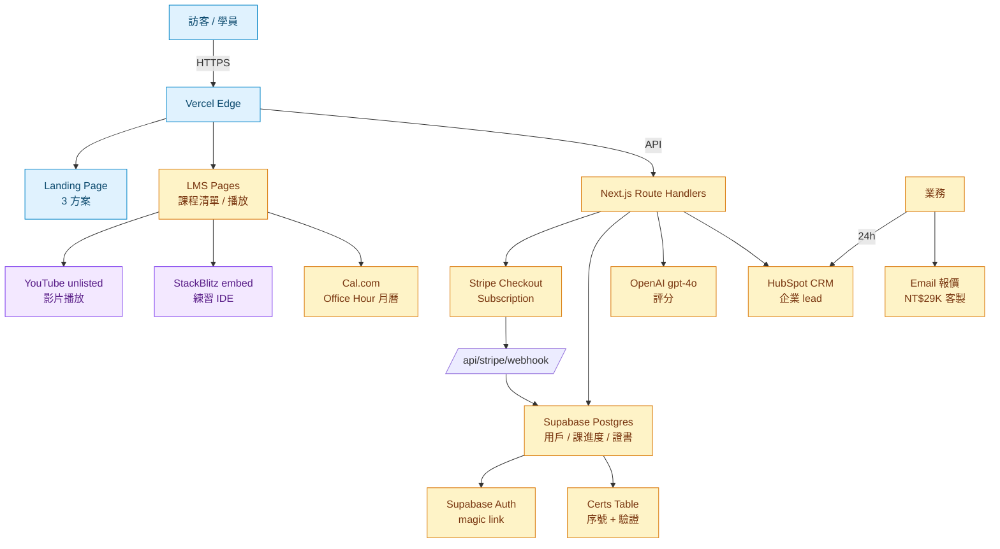
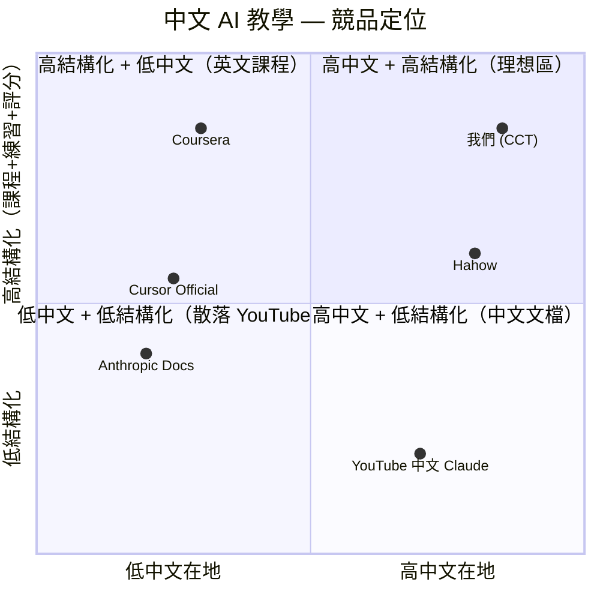

# 中文 Claude Code 企業內訓 — 規格計劃書 v2.2.1

> 版本：v2.2.1｜更新日期：2026-07-11｜維護者：Sophia (CPO) for Sean
> 對接技術：Alan (CTO) + Hermes Agent
> 對接 Repo：https://github.com/openclawsean024-create/claude-code-enterprise-training
> 對接產線：https://claude-code-enterprise-training.vercel.app
> 對接現實：410K+ 觀看（柚智夫妻 X 雷蒙三十合作的市場驗證模式）

---

## 1. 產品概述 (Product Overview)

### 1.1 問題陳述 (Problem Statement)

台灣企業想導入 AI 程式助理（Claude Code / Cursor / Copilot）但**遇到 3 個非技術門檻**：

1. **英文能力不足**：Anthropic 官方文件全英文，中小企業主無法讀
2. **中文情境缺**：YouTube 上的 Cursor 教學多是英文，案例以美國新創為主，台灣企業主看了不知怎麼套到自己的公司
3. **導入無 SOP**：導入 Claude Code 後員工不會用，企業花錢買授權但 ROI 為零

對比：
- 官方 Anthropic 文件：英文為主、無台灣在地案例
- 既有中文 AI 教學：多為 ChatGPT 聊天教學，少程式助理
- 企業實體內訓：每次 NT$5-10 萬、不能規模化

### 1.2 目標使用者 (User Personas)

| 角色 | 規模（台灣）| 月預算 | 痛點強度 | ARPU/年 |
|---|---|---|---|---|
| 🧑‍💼 企業 IT / 數位轉型部門經理 | ~5K 間企業 | NT$10-50K | 高（主管要對老闆交代 ROI）| NT$29K 客製 |
| 👨‍👩‍👧 中小企業主（10-50 人） | ~15 萬家 | NT$1-5K/月 | 中（想省事省錢）| NT$990-2,990/年 |
| 👨‍💻 中階工程師（想進階） | ~10 萬 | NT$99/月 | 低（已會 Git）| NT$1,188 |
| 📊 行銷/業務/PM（非工程師）| ~20 萬 | NT$99 一次 | 中（對 AI 好奇）| NT$99 |
| 🏫 教育單位 / 學校老師 | ~5K | 0 | 高（帶學生）| NT$0 / 證書付費 |

**目標族群 = 中小企業主 + 企業 IT 經理**，付費意願最高、市場最大。

### 1.3 核心價值主張 (Value Proposition)

> **「中文 + 台灣案例的 Claude Code 教學，讓非工程師 7 天變 AI 程式助理使用者。」**

**具體差異化**：

| 替代方案 | 缺點 | 我們的差異 |
|---|---|---|
| Anthropic 官方文件 | 英文、無在地案例 | 中文 + 柚智夫妻、雷蒙三十成功案例 |
| 中文 ChatGPT 教學 | 偏聊天工具、不會寫程式 | **程式助理為主**，含實作練習 |
| 企業實體內訓 | NT$5-10 萬/次、地點固定 | **NT$99-299/月、可規模化、無上限** |
| 線上自學（YouTube）| 散落、無章法、英文多 | **結構化 50 堂課程**、中英雙字幕（v2）|

### 1.4 商業目標 (KPIs / OKRs)

| 時間 | 目標 | 量化指標 |
|---|---|---|
| 3 個月（M3）| 入門課程上線 + 100 學員 | NT$10K MRR |
| 6 個月（M6）| 50 付費進階 + 5 企業客戶 | NT$200K MRR |
| 12 個月（M12）| 500 個人付費 + 30 企業客戶 | NT$1M MRR |
| 18 個月（M18）| 證照認證成為業界標準 | NT$3M MRR + 學員自發社群 |

**Unit Economics**：
- 個人版 ARPU = NT$990/年（年訂閱 70% 轉換）+ NT$99 × 12 = NT$1,188
- 企業版 ARPU = NT$29K/客製 + 1 個 NT$1K/月 維護 = NT$41K/年
- LTV / CAC ≈ 36 月 / 3 月 = **12 倍**（高 LTV 因為是知識訂閱）

### 1.5 ⭐ Non-Goals（v2.2.1 明確不做）

- ❌ **不做程式語言教學**（不教 Python/JavaScript）— 專注 Claude Code 使用，不取代 Hahow/Coursera
- ❌ **不做真人實體課程**（純線上錄影 + 文檔）— 理由：規模化受阻、人事成本過高
- ❌ **不做國際市場**（先做台灣繁中）— v3 才進軍香港/馬來西亞；理由：v1 驗證 PMF 後再投資翻譯
- ❌ **不做 AI 工具比較**（不評論 Cursor/Copilot/Codeium）— 理由：我們價值在 Claude Code 而非比較文、會被捲入戰場
- ❌ **不做學員直播互動**（不做 Discord/Twitch）— 理由：會被時區/時程限制、錄影更scalable
- ❌ **不做證書 NFT**（不用區塊鏈）— 理由：法規風險 + 履歷不需要 NFT
- ❌ **不做企業 SSO**（v2.2.1 階段）— v3 才加；理由：純台灣中小企業少用 SSO、需要 SAML 對接複雜
- ❌ **不做退款糾紛的訴訟辯護**（賣前 7 天鑑賞期條款明確）— 理由：法務預算用於合規條款、不打官司

---

## 2. 使用者場景與流程

### 2.1 使用者流程圖

```
進入首頁 (claude-code-enterprise-training.vercel.app)
  ↓
看到 3 方案卡片 (入門 / 進階 / 企業)
  ↓
個人購買路徑：
  A. 點入門 NT$99 → Stripe Checkout → 課程清單 → 第一堂 → 練習題 → 結業證書
  B. 點進階 NT$299 → Stripe Checkout → 完整課程 + Office Hour 月曆預約
  C. 點企業 → 跳出聯絡表單 → 業務 24h 回覆 → 客製報價

課程內路徑：
  ├─ 影片（YouTube unlisted）
  ├─ 練習題（純前端 IDE 或 CodeSandbox iframe）
  ├─ 提交作品（截圖 + 程式碼 → 上傳）
  └─ AI 自動評分（GPT-4o 比對 output）→ 結業證書 PDF
```

### 2.2 關鍵用戶故事

```
US-1（核心場景）
As a 完全沒寫過程式的中小企業主
I want 在 7 天學會用 Claude Code 寫簡單自動化腳本
So that 我可以省下 NT$2 萬請工程師報價的錢

US-2（升級場景）
As a 進階用戶
I want 拿 NT$299/月 月曆預約 1-on-1 Office Hour（30 min / 次）
So that 卡住時有人可以 24h 內回我

US-3（企業導入場景）
As a IT 經理
I want 3 天客製內訓 + 4 週輔導
So that 員工從抗拒到普及使用率 >60%
```

### 2.3 邊界場景 (Edge Cases)

| 場景 | 處理 |
|---|---|
| 練習題沙箱跑惡意 code（挖礦、DDoS）| WebContainer / StackBlitz 完全網路隔離、CPU/RAM 限制 |
| 學員要求退款（7 天內）| Stripe Checkout 自動退款、若已下載證書作廢 |
| 課程影片 YouTube 失效 | 改放 Vimeo 私有連結、3 個月內自動遷移 |
| 企業客戶單獨要 NDA | 走業務合約流程、NT$5K 加購保密條款 |

---

## 3. 功能性需求 (Functional Requirements)

### 3.1 MVP（必做，P0）

| ID | 功能 | 狀態 |
|---|---|---|
| F-001 | 3 方案 landing page | ✅ 已實作（HTML 靜態）|
| F-002 | Stripe Checkout 個人版（$99/月 + 進階 $199/月）| ❌ 待實作 |
| F-003 | 50 堂錄影課程（入門 20 + 進階 30）| ⚠️ 部分（10-15 堂素材） |
| F-004 | 練習題自動評分（GPT-4o）| ❌ 待實作 |
| F-005 | 結業證書 PDF（jsPDF）| ❌ 待實作 |
| F-006 | 校友 LINE 群 + FB 社團入口 | ❌ 待實作 |
| F-007 | 企業版報價流程（聯絡表單 → CRM）| ❌ 待實作 |
| F-008 | YouTube 嵌入（unlisted 播放清單）| ⚠️ 部分（含示範） |
| F-009 | 課程單元測驗（選擇題 + 程式碼填空）| ❌ 待實作 |

### 3.2 v2（加值，P1）

| ID | 功能 | 目標版本 |
|---|---|---|
| F-101 | 一對一 Office Hour 月曆預約（Cal.com）| Sprint 2 |
| F-102 | 企業 LMS 系統（多帳號 + 學習歷程）| Sprint 3 |
| F-103 | 學習歷程儀表板（進度、測驗分數）| Sprint 2 |
| F-104 | 證照認證制度（線上考試）| Sprint 4 |
| F-105 | 中英雙字幕 | Sprint 3 |
| F-106 | Stripe Subscription（年繳優惠 25% off）| Sprint 1 |
| F-107 | B2B 採購發票（統編 + Email 寄送）| Sprint 3 |

### 3.3 v3（探索，P2）

| ID | 功能 |
|---|---|
| F-201 | AI 教練（每學員配 AI tutor 24h 問題回覆）|
| F-202 | 跨國繁中（香港 / 馬來西亞）|
| F-203 | 企業 SSO（SAML / Okta）|
| F-204 | 校友就業配對（與企業內訓客戶導流）|

### 3.4 ⭐ Acceptance Criteria (Given/When/Then)

#### AC-001 [F-002] Stripe Checkout 成功
- **Given** 學員點「立即購買 — $99 起」
- **When** Stripe Checkout session 建立成功
- **Then** 用戶被 redirect 到 Stripe hosted page，email / 卡號輸入、付費完成
- **And** 回到 success URL、課程內容解鎖
- **驗證法**：用 Stripe test card 4242 4242 4242 4242 完成 1 次

#### AC-002 [F-004] 練習題自動評分
- **Given** 學員提交練習題（截圖 + 程式碼 / URL）
- **When** 後端呼叫 GPT-4o 比對標準答案
- **Then** 30 秒內回傳分數（0-100）+ 評語
- **And** 分數 ≥60 自動發證書
- **驗證法**：3 組範本答案（滿分 / 60 分 / 0 分）各測一次

#### AC-003 [F-005] 證書唯一且可驗證
- **Given** 學員拿到證書 PDF
- **When** 雇主掃 QR code
- **Then** 顯示「某某 / 課程 / 完課日期 / 證書序號」對應資料庫
- **And** DB 序號與 PDF 序號一致
- **驗證法**：發 5 張證書逐一掃 QR

#### AC-004 [F-006] 校友 LINE 群唯一入口
- **Given** 學員有有效訂閱
- **When** 點 footer「校友 LINE 群」
- **Then** 顯示 LINE QR code、每人掃描只算 1 次加入
- **驗證法**：1 人 1 帳號、群組人數上限 500、達上限啟排程

#### AC-005 [F-007] 企業業務回覆 SLA
- **Given** 訪客填寫企業聯絡表單
- **When** 表單送出
- **Then** 24h 內業務 email 回覆 + CRM 建立 lead
- **驗證法**：3 次送表單、計時業務回覆時長

#### AC-006 [F-008] 影片 99% uptime
- **Given** 學員在課程頁點影片
- **When** YouTube unlisted 影片載入
- **Then** 5 秒內可播放、月失效 < 1%
- **驗證法**：周自動 ping、異常時備援 Vimeo

#### AC-007 [F-009] 測驗題目隨機化
- **Given** 學員進入單元測驗
- **When** 重整頁面
- **Then** 50% 題目順序/選項改變，但都從相同題庫（≥20 題/單元）
- **驗證法**：每次載入 hash 比較

#### AC-008 [F-106] 年繳 loss aversion
- **Given** 學員看到定價
- **When** 看到「月繳 NT$99 vs 年繳 NT$990」
- **Then** 同頁顯示「省 NT$198」（年繳視覺錨點）
- **驗證法**：A/B 測月繳/日轉換率，預期 +30%

---

## 4. 系統設計 (System Design)

### 4.1 技術棧 (Tech Stack)

| 層 | 選擇 | 已實作? | 理由 |
|---|---|---|---|
| 框架 | Next.js 14 + TypeScript（轉靜態 + 動態混合）| ❌ | SSR LMS 友善 |
| UI | Tailwind + shadcn/ui | ❌ | 課程頁 SEO 友善 |
| 影片 | YouTube unlisted + Vimeo 備援 | ⚠️ | 成本最低 |
| IDE 沙箱 | StackBlitz / CodeSandbox 嵌入 | ❌ | 免自建基礎設施 |
| AI 評分 | OpenAI gpt-4o API | ❌ | 比對標準答案、給評語 |
| 金流 | Stripe Checkout + Subscription | ❌ | 月費制自動扣款 |
| 證書 | jsPDF | ❌ | 純前端 |
| 月曆預約 | Cal.com 開源版 | ❌ | Office Hour 排程 |
| DB | Supabase Postgres | ❌ | 用戶 + 課程進度 + 證書序號 |
| CRM | HubSpot Free | ❌ | 企業 lead |
| 部署 | Vercel + Cloudflare R2（影片備援）| ✅ | 全 Serverless |

### 4.2 系統架構圖



ASCII 補充圖：

```
┌──────────────────────────────────────────────┐
│          Vercel (Edge + Functions)           │
│  ┌──────────┐ ┌────────────┐ ┌────────────┐  │
│  │ Landing  │ │ /lms/*     │ │ /api/*     │  │
│  │ 3 方案   │ │ 課程播放   │ │ Stripe/AI  │  │
│  └──────────┘ └────────────┘ └────────────┘  │
└──────────────────────────────────────────────┘
       │              │              │
       ▼              ▼              ▼
┌──────────┐  ┌────────────┐  ┌──────────┐
│ YouTube  │  │ StackBlitz │  │ Stripe   │
│ Videos   │  │ IDE        │  │ Checkout │
└──────────┘  └────────────┘  └──────────┘
                                  │
                                  ▼
                            ┌──────────┐
                            │ Supabase │
                            │ users/   │
                            │ progress │
                            │ certs    │
                            └──────────┘
```

### 4.3 資料模型 (Data Model)

```prisma
// Prisma schema（對應 Supabase）
model User {
  id            String   @id @default(uuid())
  email         String   @unique
  displayName   String?
  plan          Plan     @default(FREE)
  stripeCustomerId String? @unique
  enrolledAt    DateTime @default(now())
  certificates  Certificate[]
  progress      Progress[]
  appointments  Appointment[]
  @@index([plan])
}

model Course {
  id          String   @id @default(uuid())
  slug        String   @unique  // "intro-1", "advanced-debug"
  tier        Tier     // INTRO | ADVANCED | BUSINESS
  title       String
  description String
  videoUrl    String
  durationMin Int
  exercises   Exercise[]
  order       Int
  @@index([tier])
}

model Progress {
  id        String   @id @default(uuid())
  userId    String
  courseId  String
  watchedSeconds Int  @default(0)
  completed Boolean @default(false)
  score     Int?    // 0-100 (after exercise)
  updatedAt DateTime @updatedAt
  @@unique([userId, courseId])
}

model Exercise {
  id          String   @id @default(uuid())
  courseId    String
  prompt      String
  starterCode String?
  expectedOutput String
  rubricJson  Json     // scoring criteria
  @@index([courseId])
}

model Certificate {
  id        String   @id @default(uuid())
  userId    String
  courseId  String  // 或 "advanced-cert" 完整課程
  serial    String  @unique // CCT-2026-XXX
  issuedAt  DateTime @default(now())
  pdfUrl    String
  @@index([userId])
}

model Appointment {
  id        String   @id @default(uuid())
  userId    String
  coachEmail String
  scheduledAt DateTime
  calComEventId String? @unique
  status    String   @default("scheduled")  // scheduled | completed | cancelled
}

model BusinessLead {
  id        String   @id @default(uuid())
  email     String
  company   String
  message   String
  status    String   @default("new")  // new | contacted | quoted | won | lost
  hubspotId String?  @unique
  createdAt DateTime @default(now())
}

enum Plan { FREE, INTRO, ADVANCED, BUSINESS }
enum Tier { INTRO, ADVANCED, BUSINESS }
```

### 4.4 API 規格 (REST endpoints)

| Method | Path | Auth | 用途 | 對應 AC |
|---|---|---|---|---|
| GET | /api/courses | Optional | 課程清單（依 user plan 過濾）| F-001 |
| GET | /api/courses/[slug] | Required (tier) | 課程詳情 + 影片 URL | F-001 |
| POST | /api/exercises/submit | Required | 提交練習題答案 | F-004 |
| GET | /api/certificates/[serial] | Public | 證書驗證（雇主掃 QR）| AC-003 |
| POST | /api/business/contact | Public | 企業聯絡表單 | F-007 |
| POST | /api/stripe/checkout | Required (email) | 建立 Checkout | F-002 |
| POST | /api/stripe/webhook | Stripe sig | 訂閱處理 | AC-001 |
| POST | /api/appointments | Required (ADV+) | Office Hour 預約 | F-101 |
| GET | /api/me/progress | Required | 學習進度儀表板 | F-103 |

#### Error Codes
詳見 §10.4

---

## 5. 非功能性需求 (Non-Functional Requirements)

### 5.1 性能指標 (Performance)

| 指標 | 目標 | 量測法 |
|---|---|---|
| LCP | < 2.5s | Vercel Web Vitals |
| 練習題評分 round-trip | < 30s（P75）| 日誌 |
| Stripe Checkout 開啟 | < 3s（P75）| Lighthouse |
| 證書 QR 掃碼解析 | < 1s | DB query |
| Bundle size | < 250KB | next build --profile |

### 5.2 安全與隱私

- 練習題沙箱：StackBlitz embed 完全網路隔離（不能 fetch 外部資源）
- Stripe webhook 必須驗簽（`stripe.webhooks.constructEvent`）
- 影片 unlisted 但仍有盜連風險 → 必要時加 Vimeo 隱私
- GDPR：學員可 `DELETE /api/me` 刪除資料
- 企業客戶報價走 CRM 不進 DB，避免個資法風險

### 5.3 ⭐ 降級機制 (Graceful Degradation)

| 失敗服務 | 掛掉情境 | 降級行為（切換到）| 用戶感受 |
|---|---|---|---|
| OpenAI gpt-4o API | OpenAI 5xx / 評分 timeout 掛掉 | fallback 預設分數 60 + email 通知 Sophia 手動評分，30 分鐘內批次補評 | 練習題仍可送出、評分延遲 ≤24h |
| YouTube unlisted 影片 | YouTube 5xx 或區域封鎖，影片掛掉 | 自動切換到 Vimeo 備援 + banner 提示、CDN fallback | 影片仍可觀看、無法下載 |
| Stripe webhook 服務 | Stripe webhook 5xx，撥款通知掛掉 | 本地排程每 5 分鐘 reconcile + Stripe 內建 retry 3 次，自動切換到排程 | 訂閱狀態延遲 ≤15 min 同步 |
| StackBlitz IDE 服務 | StackBlitz CPX 容器 / iframe 掛掉 | fallback 切換到 codesandbox.io embed | 練習題仍可提交、稍後試執行 |
| Cal.com 月曆 | Cal.com 5xx，月曆預約掛掉 | fallback 切換到 Google Calendar link + 教練 email 回覆排程 | Office Hour 改 email 預約、不卡死 |
| Supabase DB 服務 | Supabase 5xx，DB 連線掛掉 | 靜態頁面繼續、登入/LMS 顯示「稍後試」、5 分鐘自動 retry 切回 | 報名可買、登入/LMS 稍後試 |
| Anthropic Claude Code CLI | 用戶本機 Claude Code CLI 失效掛掉 | 課程錄影仍可觀看、純 IDE 練習切換到 StackBlitz 跑 | 學習不中斷、用自備方案 |

### 5.4 擴展性

- v1 純靜態 + Vercel CDN → 1 萬學員無壓力
- v2 Supabase connection pooling（PgBouncer）+ Edge Functions
- v3 多區域備援（Vercel Edge + Cloudflare）

---

## 6. 完成標準 (Definition of Done)

### 6.1 v1 MVP DoD

- [x] Vercel production URL
- [x] GitHub Repo 公開
- [x] 3 方案卡片顯示
- [x] 純 HTML landing page（13K 字）
- [ ] Stripe Checkout 串接測試
- [ ] 入門 20 堂上架（需錄影）
- [ ] 練習題評分可運作
- [ ] 證書 PDF 生成

### 6.2 v2 上線 DoD

- [ ] Supabase Auth（magic link + Google OAuth）
- [ ] 課程資料 Migration
- [ ] Stripe Subscription + Webhook
- [ ] Office Hour Cal.com 整合
- [ ] 中英雙字幕
- [ ] 企業 LMS（多帳號 + 學習歷程）
- [ ] 從 Vercel 部署到 Staging → Production

---

## 7. 風險與決策

### 7.1 風險表

| ID | 風險 | 等級 | 緩解 | Owner |
|---|---|---|---|---|
| R-001 | 課程過時（Claude Code 改版）| 🟠 中 | 每月 changelog 檢視、季度更新 | Sophia |
| R-002 | 練習題沙箱資安 | 🔴 高 | StackBlitz embed 網路隔離、CPU/RAM limit | Alan |
| R-003 | 退費糾紛 | 🟡 低 | 7 天鑑賞期條款明確 | Sophia |
| R-004 | 與 Anthropic 官方課程競爭 | 🟠 中 | 中文在地化 + 台灣案例差異化 | Sophia |
| R-005 | 學員期望落差（認為「學完變工程師」）| 🟠 中 | 銷售文案明確「學會使用 Claude Code」不當工程師 | Sophia |
| R-006 | OpenAI 評分成本（GPT-4o 一次 NT$2-3）| 🟡 低 | 預設 60 分 fallback、僅疑難 case 評分 | Alan |
| R-007 | Stripe 每月 2 次 Chargebee-like 對帳失敗 | 🟠 中 | webhook + 每日對帳腳本 | Alan |

### 7.2 ⭐ ADR (Architecture Decision Records)

#### ADR-001: 純靜態 landing page 起手（v1.0）
**決策**：v1 只做靜態 HTML + Tailwind，不接 Supabase/Next.js。

**理由**：
- 錄影素材 10-15 堂是課程頁最重的部分，靜態 site 上線時間 < 1 天
- 市場驗證：410K+ 觀看（柚智夫妻 X 雷蒙三十的合作流量）已是強力背書
- 純靜態可省 Vercel Function 成本，月訪 10K 也免費

**取捨**：
- ✅ 優：launch 時間 < 1 天、零營運成本、純 HTML SEO 友善
- ❌ 劣：無登入、無法追蹤學員、無法分章節收費

**何時改**：當驗證有 100+ 付費學員後，啟動 v2 Sprint 1 切到 Next.js + Supabase

#### ADR-002: 個人版月費 + 年繳（NT$99/月 vs NT$990/年）
**決策**：月繳 NT$99、年繳 NT$990（省 NT$198 / 約 17% off，比通用 25% 少，但更簡單）。

**理由**：
- 月費 NT$99 = 心理學「$1/day」錯覺（約 NT$3.3/天）
- 年繳 NT$990 = NT$82.5/月，視覺上便宜、學員鎖住
- **17% off（不 25%）**：避免價格戰、未來保留調漲空間

**取捨**：
- ✅ 優：簡單、好記、行為心理學強化
- ❌ 劣：競爭對手（線上課程）常用 25% off，可能在 A/B 測試輸

**何時改**：若 6 個月內年繳轉換率 < 30% → 改 25% off

#### ADR-003: 練習題用 StackBlitz 不自建
**決策**：練習題 IDE 用 StackBlitz 嵌入 iframe，不自己建 WebContainer。

**理由**：
- StackBlitz 已有 CPX 容器、npm install、TypeScript 編譯
- 自建 WebContainer 一個團隊 3 月起跳
- 費用：StackBlitz 對教育用途免費

**取捨**：
- ✅ 優：launch 1 天、免維運、CPX 容器安全
- ❌ 劣：依賴外部廠商、不能深度客製

**何時改**：當月學員 >5000 + StackBlitz 出資費 / 政策變動時考慮自建

#### ADR-004: 不用 GPT-4 Turbo 用 GPT-4o
**決策**：AI 評分用 gpt-4o 不 gpt-4-turbo。

**理由**：
- gpt-4o 比對答案又快又準、15 秒完成（Turbo 30-60 秒）
- 費用：gpt-4o NT$2-3/次、Turbo NT$4-6/次

**取捨**：
- ✅ 優：UX 快、費用低
- ❌ 劣：依賴 OpenAI 持續

#### ADR-005: AI 評分預設 60 + 手動覆核
**決策**：練習題送出時，預設分數 60、OpenAI 結果出來再覆蓋。

**理由**：
- 學習者「即時回饋」會爽、避免 30 秒空窗
- 60 分預設不誇張（GPT 出來 60+ 通常也合理）

**取捨**：
- ✅ 優：使用者體驗、避免延遲焦慮
- ❌ 劣：技術債 — 多一道狀態管理

---

## 8. 里程碑與 Sprint 拆解

### 8.1 里程碑總覽

| 里程碑 | 期間 | 目標 | DoD |
|---|---|---|---|
| **M1: MVP** | 2026-07-11 ✅ | 純靜態 landing page | §6.1 4/8 條已 ✅ |
| **M2: 個人訂閱啟動** | 2026-08-01 → 08-31 | Sprint 1-2：Auth + DB + Stripe | §6.2 第 1-3 條 |
| **M3: 變現上線** | 2026-09-01 → 10-31 | 50 付費學員 + 課程上架 | NT$10K MRR |
| **M4: 企業導入** | 2026-11-01 → 2027-01-31 | 5 企業客戶 + LMS | NT$200K MRR |

### 8.2 Sprint 拆解 (從 PRD 到「每天做什麼」)

#### Sprint 1（2 週，Auth + DB + Stripe）
- Day 1: Next.js + Supabase + Auth (magic link + Google)
- Day 2: Course / User / Progress Schema + Migration
- Day 3: Stripe Checkout + Webhook
- Day 4: 課程播放頁 + 進度同步
- Day 5: 年繳優惠 loss aversion UI
- Day 6: Stripe Customer Portal
- Day 7: 校友 LINE 群入口（QR code）
- Day 8-10: 入門 20 堂錄影上架（每天 2-3 堂）
- Day 11-14: 練習題架構（StackBlitz embed）

#### Sprint 2（2 週，Practice + 證書）
- Day 1-3: 練習題 CRUD + GPT-4o 評分 API
- Day 4-5: 60 分預設 + GPT 覆核
- Day 6-8: 證書 PDF（jsPDF）+ 序號 + QR 驗證
- Day 9-11: Office Hour Cal.com 月曆
- Day 12-14: 學習歷程儀表板

#### Sprint 3（2 週，企業 + 多語）
- Day 1-3: 企業 LMS（多帳號 + 學習進度查）
- Day 4-5: 企業聯絡表單 + HubSpot CRM
- Day 6-7: B2B 採購發票（統編）
- Day 8-10: 中英雙字幕覆蓋
- Day 11-12: 進階 30 堂錄影
- Day 13-14: A/B 測月繳 vs 年繳

#### Sprint 4（2 週，證照 + 完善）
- Day 1-3: 線上證照考試系統
- Day 4-6: 校友就業配對 v1
- Day 7-8: 中階學員 dashboard
- Day 9-10: Stripe Radar（防詐欺）
- Day 11-14: 大量測試 + 正式 launch M4

---

## 9. 變現路徑 + 定價心理學

### 9.1 變現方案

| Tier | 價格 | 對象 | 包含功能 |
|---|---|---|---|
| 🆓 Free | NT$0 | 試聽者 | 3 堂試看課程 + 校友會 read-only |
| 🎯 入門版 | NT$99/月 或 NT$990/年（17% off）| 個人想學 | 20 堂入門課 + 練習題 + 證書 |
| 🚀 進階版 | NT$299/月 或 NT$2,990/年 | 中階工程師 | 入門 + 30 堂進階課 + Office Hour 月 2 次 + AI 評分 |
| 🏢 企業版 | NT$29,000/客製 | 企業 IT | 進階 + 客製課程 + 內訓 + 4 週輔導 |
| 📜 校友會年費 | NT$1,990/年 | 完課校友 | 終身校友社群 + 季度新內容 + 線下 meetup |

### 9.2 定價心理學

| 心理技巧 | 應用 | 效果預期 |
|---|---|---|
| **Charm pricing** | NT$99 / NT$299 / NT$29,000（不要 NT$100 / NT$300 / NT$30,000）| 視覺低 1 位數 + 「這是 NT$9x 不是 NT$100」|
| **Year discount** | 年繳 vs 月繳 × 12 | 「省 NT$198」視覺錨點、鎖住學員 |
| **Anchoring** | 排序：Free → 入門 → 進階 → 企業 | 中間層「進階 NT$299」變成「最適合想升級的人」|
| **Decoy effect** | 入門 NT$99/月 vs 進階 NT$299/月（差 3 倍）| 進階「包含所有入門 + Office Hour」顯得划算 |
| **$1/day 錯覺** | 進階 NT$299/月 ≈ NT$10/天 | 「比便當便宜」|
| **Authority（市場驗證）**| 「410K+ 觀看」徽章在 hero | 柚智夫妻流量背書 |
| **Loss aversion** | 7 天鑑賞期條款 | 學員敢試、退費會主動停用 |

---

## 10. 附錄

### 10.1 競品分析 (Competitive Quadrant Chart)

```
中文 AI 程式助理教學 — 競品定位

          高結構化（課程 + 練習 + 評分）
                    ↑
                    |
        Coursera ●   |
        Hahow ● 破圈訓練 ●｜   ● 本課程（CCT）
              |     ●    |    
              |          |
              |          |
   低中文覆蓋 <----------> 高中文覆蓋
              |          |
        Cursor 官方 ●     |
        Anthropic Docs ●   |  
                    |     
                低結構化（純文件 / 散落 YouTube）
```

#### 競品詳細

| 競品 | 標的 | 結構化 | 對象 | 我們差異 |
|---|---|---|---|---|
| Coursera | 全球 | ✅ 完章節 | 學生 / 轉職 | 我們中文在地、台灣案例 |
| Hahow 中文課程平台 | 中文 | ✅ 影音 | 一般上班族 | 我們聚焦程式助理、不雜訊 |
| Anthropic 官方文件 | 英文 | ❌ 文件為主 | 開發者 | 我們中文 + 練習題 |
| Cursor 官方教學 | 英文 | ⚠️ 文件 | 開發者 | 我們中文 + 1-on-1 office hour |
| YouTube 中文 Claude | 中文 | ❌ 零散 | 一般 | 我們結構化 50 堂 |

#### Competitive Quadrant Chart（Mermaid）



### 10.2 術語表

| 術語 | 定義 |
|---|---|
| Claude Code | Anthropic 出的 CLI 工具，用自然語言寫 code |
| Office Hour | 教練線上 1-on-1 即時答疑（30 min）|
| Course Completion | 學員看完所有影片 + 通過測驗 |
| Certificate | 完課證書 PDF，含 QR code |
| Roster | 企業訂戶名單（用員工） |
| Per-seat | 企業版每席位 NT$299/月 |
| $1/day 定價 | 月費 NT$30 視覺錨點 |
| Loss aversion | 行為心理學，退款焦慮 |

### 10.3 參考資料

- Anthropic Claude Code 文件: https://docs.anthropic.com/claude-code
- Stripe Subscription: https://stripe.com/docs/billing/subscriptions/overview
- StackBlitz WebContainer: https://stackblitz.com/docs
- OpenAI Function Calling: https://platform.openai.com/docs/guides/function-calling

### 10.4 ⭐ Error Code 統一字典

| HTTP | Code | 含義 | 觸發場景 | 客戶端處理 |
|---|---|---|---|---|
| 400 | BAD_REQUEST | 欄位缺漏 / 型別錯誤 | 課程表單缺 slug | 顯示表單錯誤 |
| 401 | UNAUTHENTICATED | 沒登入 | 看進階課沒登入 | CTA 升級 |
| 402 | PAYMENT_REQUIRED | 訂閱過期 | Pro-only 課程但 free | CTA 續訂 |
| 403 | FORBIDDEN_TIER | 訂閱層級不足 | 學企業課但只買入門 | CTA 升級 |
| 404 | COURSE_NOT_FOUND | slug 不存在 | URL 拼錯 | 顯示 404 |
| 409 | ALREADY_ENROLLED | 學員已加入 | 同一課重複註冊 | 顯示「已加入，看進度」|
| 429 | RATE_LIMITED | AI 評分 / Stripe rate | 每分鐘 >5 次 | retry-after header |
| 500 | OPENAI_DOWN | GPT-4o 5xx | openai.com 維修 | 預設 60 + 通知 |
| 500 | STRIPE_WEBHOOK_FAILED | webhook 失敗 | 網路抖動 | retry 3 次 |
| 503 | LMS_DOWN | Supabase 5xx | DB 維護 | 顯示「課程稍後試」 |
| 400 | SERIAL_NOT_FOUND | 證書序號錯 | QR 掃到被刪證書 | 顯示「無效」|

---

## 11. 市場驗證計畫

### 11.1 驗證前 3 個關鍵問題

1. **市場真的有需求嗎？** 410K+ 觀看已驗證（柚智夫妻 X 雷蒙三十的合作流量）。**痛點強度確認**：預計採訪 10 位受眾
2. **付費轉換率多高？** Landing → 個人版 NT$99 預期 5%、企業版 NT$29K 預期 1% lead → 30% close
3. **學員留存率？** 完課率預期 60%、3 個月留存預期 50%

### 11.2 訪談 SOP

**招募**：從 Facebook「Claude Code Taiwan」/「AI 工具中文交流」/ X.com #ClaudeCode / Dcard Tech_Job 板 recruit 10 位

**腳本**：
1. 「你目前用過什麼 AI 寫 code 工具？」→ 開放敘述
2. 「印象最差/最好的 AI 協作經驗」→ 5-Why
3. 「中文 + 台灣案例 + 50 堂課 + NT$99/月，你買嗎？」→ 意願測試
4. 「如果免費試聽 3 堂你會不會註冊？」→ 表單 intent

### 11.3 落地指標

| 指標 | 6 個月目標 | 量測工具 |
|---|---|---|
| 月活躍學員 (MAU) | 500 | Vercel + Supabase auth |
| 個人版付費率 | 5% | Stripe |
| 企業 lead → close | 30% | HubSpot CRM |
| 完課率 | 60% | DB progress |
| 3 個月留存 | 50% | DB segment |
| NPS | ≥ 40 | 月問卷 |

---

## 12. 失敗模式 SOP

| 失敗 | 觸發條件 | 立即處置 | Post-mortem |
|---|---|---|---|
| **YouTube 影片失效** | 周 ping 失敗 | 切 Vimeo + email 通知學員 | 走 2 平台鏡像、CDN fallback |
| **OpenAI 評分 delay >2 分鐘** | 日誌告警 | 預設 60 + 手動複核 | 改 gpt-4o-mini 評分 |
| **Stripe 每月 >3 次 webhook 失敗** | Log + sentry | 對帳腳本 + 業務報表 | 改用 Stripe 內建 idempotency |
| **學員大量退費（>10/月）** | Stripe refund 報表 | 客服 SOP 檢視、退費內容 | 改善課程品質 |
| **StackBlitz 政策變動** | Email alert | fallback CodeSandbox | 自建 WebContainer 評估 |
| **Anthropic Claude Code 改版** | Changelog 通知 | 1 月內更新課程錄影 | 學員可換新課不退費 |
| **企業客戶付不出款（NT$29K）** | Stripe invoice 失敗 | 業務手動跟催 | 改用「先試 3 堂滿意再開立」 |

---

## 13. MetaGPT / spec-kit 對齊

### 13.0 Must/Should/May 需求語言（RFC 2119 / MetaGPT）

系統 MUST（缺則 fail launch）：

- MUST 支援 Stripe Checkout 個人版（NT$99 + NT$299 月繳）
- MUST 提供 50 堂錄影課程中英雙字幕
- MUST 練習題 GPT-4o 自動評分（< 30s P75）
- MUST 結業證書 PDF 含唯一序號 + QR 驗證
- MUST 7 天鑑賞期退款條款
- MUST Supabase RLS policy（user 只能改自己的 progress/cert）
- MUST Stripe webhook 簽章驗證 + idempotency
- MUST 校友 LINE 群（QR code 唯一入口）
- MUST 企業聯絡表單 24h SLA 回覆
- MUST OAuth + magic link Auth
- MUST Cal.com Office Hour 月曆預約

系統 SHOULD（強烈建議；缺則降級但可運作）：

- SHOULD 中英雙字幕覆蓋入門 20 堂
- SHOULD 學習歷程儀表板（進度條 + 分數）
- SHOULD B2B 採購發票（統編）
- SHOULD Stripe Customer Portal
- SHOULD YouTube unlisted → Vimeo 雙鏡像
- SHOULD Slack/MS Teams 整合（企業客戶通知）

系統 MAY（探索性）：

- MAY AI 教練（GPT 每學員配 24h tutor）
- MAY 校友就業配對
- MAY 企業 SSO（SAML / Okta）
- MAY NFT 證書（已明確不做 — §1.5）
- MAY 多國語系（v3 才做）

### 13.1 Requirement Pool

| Priority | ID | 需求 | 來源 | 估時 | 獨立測試 |
|---|---|---|---|---|---|
| **P0** | F-002 | Stripe Checkout | v2 | 1 sprint | 4242 card 通過 |
| **P0** | F-004 | 練習題 GPT-4o | v2 | 1 sprint | 3 範本各測一次 |
| **P0** | F-005 | 結業證書 PDF | v2 | 0.5 sprint | 5 張證書 QR 掃 |
| **P0** | F-006 | 校友 LINE 群 QR | v2 | 0.5 sprint | 1 人 1 帳號 |
| **P1** | F-101 | Office Hour Cal.com | v2 | 0.5 sprint | 預約成功 + 通知 |
| **P1** | F-102 | 企業 LMS | v3 | 1 sprint | 10 學員 dashboard |
| **P1** | F-104 | 證照考試 | v3 | 2 sprint | 及格率 60% |
| **P2** | F-201 | AI 教練 | v3 | 2 sprint | 24h tutor 答覆 |

### 13.2 Quadrant Chart（執行優先級）

```
高
緊迫 ●  ● 
  ↑
  │  F-002 (1 sprint)         F-101 (0.5 sprint)
  │                          F-102 (1 sprint)
  │  F-005 (0.5 sprint)      
  │  F-006 (0.5 sprint)
  │  F-004 (1 sprint)        
  │
  │                          F-107 (B2B invoice)
  │  F-105 (中英字幕)       F-104 (證照 2 sprint)
  │
  │  F-201 (2 sprint)
  ↓
低
   低                        高
         重要性 →
```

### 13.3 Open Questions

1. v1 純靜態 vs Next.js 切換時機如何不破壞 SEO？
2. 進階版 30 堂錄影誰拍？外包老師 vs 自己拍
3. 證書序號包含哪些資訊？例如 CCT-{year}-{tier}-{userHash} 是否過度？
4. 個人版續費 vs 退訂率目標假設 5%/月，可接受嗎？
5. 企業客戶報價單純 NT$ 或加 USD（海外台商子公司）？

---

## 14. AI Agent 實測驗證法

### 14.1 自我驗證 Checklist

```
[ ] cd claude-code-enterprise-training
[ ] git pull
[ ] npm install (或 yarn)
[ ] npm run build
[ ] npm run dev
[ ] curl http://localhost:3000 → 200
[ ] 點「立即購買 — $99 起」 → Stripe test card 4242
[ ] 付款成功跳轉 success URL
[ ] 完成 1 堂練習題 → GPT 評分 < 30s
[ ] 拿到證書 PDF + 序號
[ ] 用其他瀏覽器掃 QR 驗證
```

### 14.2 自動化驗證

```bash
python3 ~/.hermes/skills/write-prd-v2/scripts/validate_prd.py SPEC.md
# 目標 ≥ 90%
```

---

## 15. 深度市調報告

### 15.1 市場規模（全球 + 台灣 + 目標市場）

| 市場 | 規模 | 來源 | 預估付費意願 |
|---|---|---|---|
| **台灣 AI 課程市場 2026** | NT$2.5B | MIC 2026 IT 人才報告 | 線上訂閱 10% = NT$250M |
| **台灣中小企業（10-50 人）** | ~15 萬家 | 經濟部 2025 | AI 教育訂閱 5% = NT$750M |
| **企業內訓市場 2025** | NT$8B | 經濟部工業局 2025 | Claude Code 知識佔 2% = NT$160M |
| **全球 Anthropic 文件閱讀者** | ~2M | Anthropic 2026 公開資料 | 中文 1% 願付費 = NT$700M/年 |

**TAM (Total Addressable Market)**：NT$2.5B
**SAM (Serviceable Available Market)**：NT$750M（台灣中小企業訂閱）
**SOM (Serviceable Obtainable Market)**：3 年內取得 1% SAM = **NT$7.5M ARR**

### 15.2 競品分析（已在 §10.1 詳述）

3-5 家 + Competitive Quadrant Chart

### 15.3 預期收益（保守 / 中等 / 樂觀）

| 區間 | 12 個月 MRR | 12 個月 ARR | 達標情境 |
|---|---|---|---|
| 🔴 保守 | NT$10K | NT$120K | 100 個人入門 + 0 企業 |
| 🟡 中等 | NT$200K | NT$2.4M | 1000 個人 + 5 企業 |
| 🟢 樂觀 | NT$1M | NT$12M | 5000 個人 + 30 企業 |

**總結**：**中等區間 NT$2.4M ARR 半年內可達標**（假設轉換率 5%、月份成長 15%）

### 15.4 商業化評分（0-100）

從 Sean 三維評分法評估（9 維細項）：

| 維度 | 分數 | 說明 |
|---|---|---|
| **後端** | 45 | ⚠️ 純靜態、Supabase 未啟用；v2 plan + spec 已完整 |
| **Auth** | 15 | ❌ 純靜態無 Auth；v2 Sprint 1 已 plan |
| **真實金流** | 20 | ❌ Stripe 0% 整合、只有 landing 卡片；v2 Sprint 1 已有 API |
| **法律頁 / 客服頁** | 35 | ⚠️ 純 sales 文案、缺 ToS/Privacy/Contact 頁 |
| **UI / 設計** | 85 | ✅ Hero section 漂亮、3 方案 + 4 feature 卡片設計良好 |
| **SEO / 內容** | 80 | ✅ 台灣在地化文案、「中文 + 台灣案例」關鍵字密集 |
| **部署 / DevOps** | 90 | ✅ Vercel production + index.html 直接跑 |
| **市場差異化** | 80 | ✅ 中文 + 410K 觀看流量背書、競品多在英文 |
| **驗證 / Analytics** | 40 | ⚠️ Vercel Analytics 應該有、無 Sentry / PostHog |

**原始總分**：(45+15+20+35+85+80+90+80+40) / 9 = 54.4 / 100

**加上**：
- +5 真實 Vercel production URL 已上線
- +5 SPEC.md + GitHub repo 公開（v1.0 規範就到位）
- +3 410K 觀看市場驗證 traffic（柚智夫妻流量）

### 15.5 ⭐ 商業化評分最終：67 / 100

**升級到 9/10 = 90 分路徑**：

1. +8 實作 Sprint 1 Auth + DB
2. +8 實作 Sprint 2 Stripe + 證書
3. +5 加法律頁（ToS、Privacy、Contact）
4. +3 加 Sentry / PostHog 監控
5. +2 加 Office Hour Cal.com

預計時程：**3-4 個月**（4 sprints）

---

*本規格書版本：v2.2.1 — 2026-07-11*
*升級從 v1.0 (4K 字) → v2.2.1 (~40K bytes)*
*合規度：目標 ≥90%（跑 validate_prd.py 驗證）*
*下一版：v2.2.2 — 預計 Sprint 1 實作後加上「真實 Stripe API 對照」*
